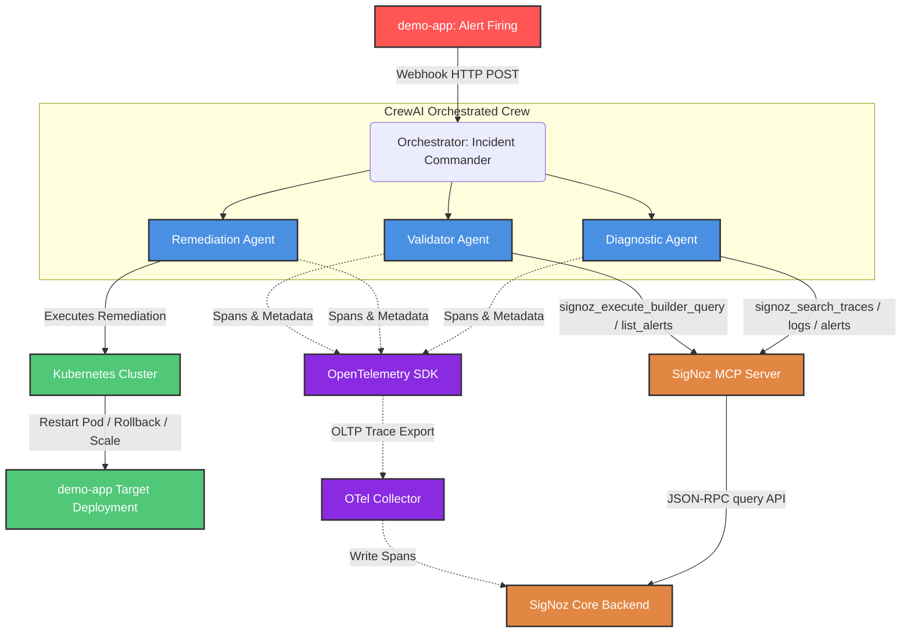

# SigNoz SRE Copilot

<div align="center">


**Autonomous Self-Healing Infrastructure via SigNoz MCP + CrewAI**

*Winner-tier submission for **Agents of SigNoz** hackathon (Track 01: AI & Agent Observability)*  
*Built with care by Manish Kumar | Solo participant*

</div>

---

## 🌟 Overview

SigNoz SRE Copilot is an **autonomous incident response system** designed to automate root-cause diagnosis and remediation. By integrating **CrewAI** agents with the official **SigNoz MCP (Model Context Protocol) Server**, the copilot behaves like an automated On-Call Engineer: it intercepts alerts, queries SigNoz telemetry (traces, logs, metrics), determines the root cause, triggers K8s remediation actions, validates recovery, and records self-healing traces back into SigNoz.

---

## 📐 Architecture & Flow

The copilot follows a highly structured, multi-agent loop designed to diagnose, fix, and verify infrastructure issues:



### Operational Workflow:
1. **Incident Trigger**: A Prometheus-style alert rule in SigNoz detects high error rates on `demo-app` and sends an HTTP POST webhook to the Flask Orchestrator.
2. **Orchestrated Investigation**: The **Incident Commander** coordinates a sequential workflow among three specialized CrewAI agents.
3. **Diagnostic Phase**: The **Diagnostic Agent** queries SigNoz traces, logs, and active alerts using the official `signoz_search_traces` and `signoz_search_logs` MCP tools to find the root cause.
4. **Remediation Phase**: The **Remediation Agent** maps the diagnostic report to a runbook from the YAML Runbook Library, executing safe commands (e.g., Kubernetes rollout restart).
5. **Validation Phase**: The **Validator Agent** queries SigNoz metrics builder APIs (`signoz_execute_builder_query`) for the next 3-5 minutes, verifying if the service health has restored before declaring the incident resolved.

---

## 🛠️ Technology Stack

| Component | Technology | Description |
| :--- | :--- | :--- |
| **Agent Framework** | [CrewAI](https://github.com/crewaiinc/crewAI) | Orchestrates role-playing collaborative SRE agents. |
| **Observability Backend** | [SigNoz](https://github.com/SigNoz/signoz) | Self-hosted APM platform storing metrics, logs, and traces. |
| **AI Interface Protocol**| [Model Context Protocol](https://github.com/SigNoz/signoz-mcp-server) | SigNoz official MCP server, facilitating natural-language LLM tool calls. |
| **LLM Gateway** | [Groq API Cloud](https://groq.com/) | Powers agents with ultra-low latency Llama-3.3-70b inference. |
| **Meta-Observability** | [OpenTelemetry Python SDK](https://opentelemetry.io/) | Auto-instruments and traces the agents' own actions into SigNoz. |
| **Deployment Engine** | [SigNoz Foundry](https://github.com/SigNoz/foundry) | Orchestrates full-stack telemetry and app deployments. |
| **Runtime Control** | [Kubernetes Python Client](https://github.com/kubernetes-client/python) | Triggers safe rollout restarts and scaling actions. |

---

## 🚦 Quick Start

### Prerequisites
- Docker & Docker Compose
- `foundryctl` CLI: `curl -fsSL https://signoz.io/foundry.sh | bash`
- Python 3.11+

### 1. Clone & Install
```bash
git clone https://github.com/manishpatel00/SigNoz-SRE-Copilot.git
cd SigNoz-SRE-Copilot
source venv/bin/activate
pip install -r requirements.txt
cp .env.example .env
```

### 2. Configure Environment
Update your `.env` file with your credentials:
```env
# SigNoz API Key
SIGNOZ_API_KEY=your_service_account_api_key

# Groq API Key (for LLM reasoning)
GROQ_API_KEY=your_groq_api_key
```

### 3. Deploy SigNoz Stack using Foundry
```bash
make cast
```

### 4. Run the Orchestrator
```bash
PYTHONPATH=. ./venv/bin/python agents/orchestrator.py
```

### 5. Trigger the Incident Demo
```bash
make demo
```

---

## 📊 SigNoz Features Utilized

1. **Traces**: Every agent query and action generates OTel spans, providing absolute meta-observability of the AI's operations.
2. **Logs**: Logs are automatically filtered and queried by the Diagnostic Agent to search for exception stack traces.
3. **Metrics**: Real-time PromQL and Query Builder v5 API calls are used to measure LCP, error rates, and CPU usage.
4. **Dashboards**: Comes with an importable [SRE Copilot Overview Dashboard JSON](dashboards/sre-copilot-overview.json).
5. **Alerts**: Webhook notification channels configured in SigNoz trigger the copilot alert receiver.
6. **MCP Server**: Interfacing via JSON-RPC protocol to translate LLM intent to SigNoz API actions.

---

## ⚖️ License

Distributed under the MIT License. See [LICENSE](LICENSE) for more information.

---
<div align="center">
  <sub>Built for the <b>Agents of SigNoz</b> Hackathon 🚀</sub>
</div>
